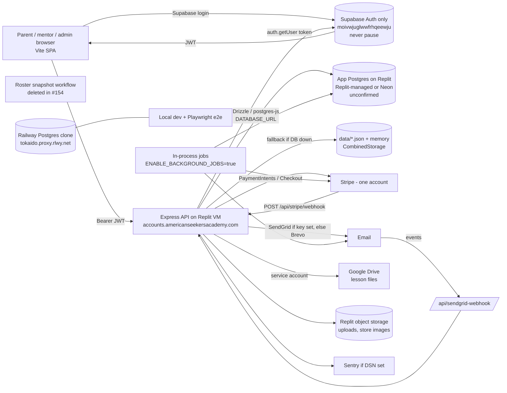

# ASA data stores and data flows

Read-only review, 2026-10-09. Code: `itsbrown/homeschool_co-op` `origin/main` @ c800d99. Also used: audit `docs/audits/2026-10-08-platform-audit.md` (branch `cursor/platform-audit-94b7`, PR #148), PR #149/#150/#152 descriptions, `/workspace/asa-strategy-review/*`, Dobby's reports.
No database, Supabase, Replit or Stripe project was touched. No env values were read. Env vars are listed by name only.

Labels: **[code]** = verified in code on main. **[audit]** = stated in the audit/PR text (code-based, not re-checked line by line). **[reported]** = from Dobby or Corey, not provable from the repo. **[conflict]** = sources disagree.

## Corrections applied with this file

These override the older conflict notes below:

- Live production **data** is the app's Postgres on Replit (`DATABASE_URL`). Whether that database is Replit-managed or Neon is still unconfirmed. [reported]
- Supabase project `moivwjuglwwfrhqeewju` is live **Auth only**. It holds no live app data. It must never be paused. [reported]
- Supabase projects **ASA Platform Prod** and **ASA Platform 2026** are old and hold no live data. [reported]
- The masking script's source is that production `DATABASE_URL`, opened read-only, ideally with a read-only role. See [masking.md](./masking.md).

## 1. Diagram

## 2. Datastores

| Store | Holds | Writers | Label |
|---|---|---|---|
| Production Postgres (`DATABASE_URL`) | Live app data: every app table in `shared/schema.ts` (~110 tables): users, schools, children, enrollments, payments, week plans, store, forms, notifications, audit logs. This is the app's Postgres on Replit. | Express API (privileged role, no RLS), Stripe webhook handler, background jobs, admin import routes | Single URL, no fallback: [code] `server/db.ts`. Code comment says Replit-managed: [code]. Roster workflow comment says Neon: [code]. Which host it actually is: **unconfirmed** [reported]. |
| Supabase Auth `moivwjuglwwfrhqeewju` | Live Auth only: `auth.users` (email, password hash, `user_metadata` / `app_metadata`). No live app tables. Must never be paused. | `POST /api/auth/register`, admin invite/migrate routes via service role, middleware auto-syncs `user_metadata` from DB | Usage [code] `server/middleware/supabase-auth.ts` (`SUPABASE_URL`, `SUPABASE_SERVICE_ROLE_KEY`). Project id, Auth-only, never pause: [reported] |
| Supabase "ASA Platform Prod", "ASA Platform 2026" | Old projects. No live data. | none | [reported] |
| Supabase "ASA Dev" | Empty and paused | none live | [reported] |
| `data/*.json` + memory | Legacy JSON (children, staff, payments, schools…) and fallback storage when Postgres is down | `CombinedStorage`, `backupService` | [code] `server/storage.ts`, `server/services/backupService.ts`. Many files tracked in git with real-looking PII [audit] |
| Replit object storage | Uploaded files, store images (`PRIVATE_OBJECT_DIR`, `PUBLIC_OBJECT_SEARCH_PATHS`) | upload routes | [code] `server/replit_integrations/object_storage/*` |
| Repo `uploads/` | 196 tracked files incl. member agreements | historic uploads committed to git | [audit] PR #152 |
| Google Drive | Lesson files, guides, payroll sheets linked from Week Planner cards | staff; app via service account (`GOOGLE_DRIVE_SERVICE_ACCOUNT_JSON` / `_FILE`) | Integration [code] `server/lib/google-drive-curriculum.ts`; contents [reported] |
| Google Cloud Storage / Document AI | OCR/document processing (`GOOGLE_CLOUD_STORAGE_BUCKET`, `GOOGLE_CLOUD_DOCUMENT_AI_PROCESSOR_ID`) | `server/services/documentAI.ts` | [code]; whether used in prod unknown |
| Stripe (one account) | Customers, PaymentIntents, Checkout Sessions, subscriptions, refunds | API, autopay job | [code]/[audit] |
| Railway Postgres clone | Test/e2e copy | local dev, Playwright `/api/test/*` seeds | [reported]; `TEST_DATABASE_URL` name [code] |
| GitHub branch `docs/fall-2026-class-rosters` | Historical Fall 2026 roster CSV. The daily workflow is deleted (#154, on `main`). | none | Do not restore `.github/workflows/fall-2026-roster-snapshot.yml` |
| Sentry | Errors (scrubbed via `shared/sentry-scrub.ts`) | server/client | [code]; DSN set in prod unknown |

## 3. Auth flow and id mapping

1. Browser signs in with Supabase JS (`VITE_SUPABASE_URL`, `VITE_SUPABASE_ANON_KEY`) and gets a JWT. [code]
2. API middleware `supabaseAuth` calls `supabase.auth.getUser(token)` with the service-role client. [code]
3. **Mapping is by email, not by `supabase_id`:** `storage.getUserByEmail(user.email)` finds the Postgres `users` row; `req.user.id` = the integer `users.id`. [code] `users.supabase_id` (unique) exists but is not the lookup key here. [code]
4. DB is the source of truth for role/school; mismatched `user_metadata` is auto-rewritten; `app_metadata` (Phase 2, `PHASE_2_APP_METADATA_ENABLED`) mismatches are logged. If the DB lookup fails, it falls back to app_metadata role/school. `users.is_active=false` → 403. [code]
5. Also accepted: `req.session.userId` (express-session, `SESSION_SECRET`) and, only when `NODE_ENV=test`, an `x-test-user-email` header. [code]
6. School context: `schools.admin_id` → `users.school_id` → `user_roles` (`server/lib/resolve-school-id.ts`). [audit]
7. Auth0 / passport code is leftover; `auth0-auth.ts` actually checks Supabase tokens. [audit, PR #152]
8. Registration: `POST /api/auth/register` creates the Supabase user and the Postgres user plus at least one child. [audit]

The live Auth project is `moivwjuglwwfrhqeewju` and it must never be paused. If it is paused, nobody can log in even with a healthy Postgres (this happened on 2026-10-09 when the project was paused for ~15 min). [reported] App rows stay in the Replit Postgres, not in Supabase.

## 4. Key tables (`shared/schema.ts`) [code]

- **Families:** `users` (parent = a user; `supabase_id`, `stripe_customer_id`, `school_id`, `role`, `is_active`), `user_roles`, `user_school_permissions`, `user_locations`, `child_guardians`, `emergency_contacts`, `schools`, `locations`.
- **Children:** `children` (`parent_id` → users; birthdate, grade, gender, allergies, medical info, special needs, notes, parent email), `school_students`.
- **Enrollments:** `program_enrollments`, `school_class_enrollments`, `membership_enrollments`, `membership_agreements`, `enrollment_price_history`, `sessions`, `programs`, `classes`, `school_classes`, `class_inclusions`, `educator_class_assignments`.
- **Week plans:** `weekly_skeletons`, `skeleton_blocks`, `week_plans`, `week_plan_blocks`, `curriculum_assets`, `supply_items`, `daily_flow_*`.
- **Events / RSVP:** `events` exists but has no RSVP; live RSVP is a store event product (`store_products` rsvp) → `store_orders` / `store_order_items` / `store_checkout_snapshots`. [code + PR #152]
- **Payments:** `payments`, `scheduled_payments`, `family_payment_plans`, `payment_allocations`, `refunds`, `refund_events`, `stripe_payment_history` (no `school_id`), `stripe_subscription_schedules`, `payment_receipts`, `payment_verification_logs`, `credits`, `credit_holds`, `unified_credit_usage_logs`, `discounts`, `discount_applications`.
- **Logs/analytics:** `email_log`, `audit_logs`, `pii_access_logs`, `error_logs`, `user_activity_events`, `checkout_funnel_events`, `notifications`, `notification_recipients`.
- PR #150 (unmerged) adds `schools.platform_*`, `brand_color`, `setup_completed_at`, `school_applications.school_id/rejection_reason` via migration 267. [audit]

## 5. Data movements

**Stripe webhook** `POST /api/stripe/webhook` (`server/webhook-handler.ts`, `constructEvent`, `STRIPE_WEBHOOK_SECRET`; dev bypass `STRIPE_WEBHOOK_DEV_BYPASS`). Handled events [code]: `payment_intent.succeeded`, `payment_intent.payment_failed`, `checkout.session.completed` (store fulfillment, membership), `charge.refunded`, `customer.subscription.created/updated/deleted`, `invoice.paid`, `invoice.payment_failed`. Fulfillment also runs server-side in `finalize-succeeded-payment-intent.ts`; webhook is backup. Fundraiser checkout has no fulfillment. [audit]
Stripe key comes from env or from the Replit Stripe connector when `REPLIT_DEPLOYMENT` is set. [audit]

**Background jobs** (in-process, `server/index.ts`; only when `ENABLE_BACKGROUND_JOBS=true`, never when `PLAYWRIGHT_WEB_SERVER=true`) [code]: JSON backup every 24h, enrollment payment reminders, checkout-funnel abandon, credit expiration, scheduled-payment reminders, scheduled notifications (60s), missed-PaymentIntent sweep, location activation batch charge, autopay off-session charges (`AUTOPAY_*` flags). Value in prod: unknown.

**Email** (`server/lib/email-service.ts`) [code]: provider = `EMAIL_PROVIDER` if forced, else **SendGrid whenever `SENDGRID_API_KEY` is set**, else Brevo. Every send is logged to `email_log`. Brevo is also called directly for invites, role invitations, school-admin welcome, notifications, school applications, account corrections. SendGrid also for store confirmations, progress reports, error notifications, plus an inbound `/api/sendgrid-webhook`. Dobby's "Brevo sends invites / SendGrid forms" is only partly right. [conflict]

**Imports / exports:** `POST /api/school-admin/import-users`, `POST /api/payment-import/upload-payments`, `admin-users` create-from-enrollments / migrate-to-supabase (unauthenticated on main, locked in PR #149); authenticated CSV export of users and children. [audit]
**Roster snapshot:** GitHub Action, daily 08:00 ET, reads prod via `PROD_DATABASE_URL`, commits real roster CSVs to branch `docs/fall-2026-class-rosters` of a **public** repo. Window was "through 2026-09-21". [code]
**Google Drive:** Week Planner cards link Drive files; server reads via service account. [code/reported]
**AI:** Anthropic/OpenAI keys used by enrollment assistant, insights, form builder. Family/child data may be sent to these. [code names; payload not traced]

## 6. Environments

| Env | App | DB | Auth | Stripe | Label |
|---|---|---|---|---|---|
| Production | Replit VM deploy, `APP_URL` = accounts.americanseekersacademy.com | App Postgres on Replit (`DATABASE_URL`). Replit-managed vs Neon unconfirmed | Supabase `moivwjuglwwfrhqeewju`, Auth only, never pause | live | [reported] |
| Replit dev workspace | port 5000 | Replit "Helium" dev DB per `database-url.mjs` comment | same Supabase? unknown | test | [code comment] |
| Local / e2e | `.env`, `.env.e2e` (gitignored) | Railway clone | real Supabase when secrets set, else mocked | `TESTING_STRIPE_*` | [reported]+[code] |
| CI | GitHub Actions | production-path tests on Postgres, mocked Supabase | — | sample test keys | [audit] |
| Concierge dev (planned) | local Postgres + Supabase "ASA Dev" (paused, empty) | — | — | none | [reported] |

Env var names (from `process.env.*` in `server/`, `shared/`) [code]:
- DB: `DATABASE_URL`, `TEST_DATABASE_URL`, `PROD_DATABASE_URL` (GitHub secret), `ASA_INTEGRATION_DB_AVAILABLE`, `ALLOW_TEST_TRUNCATE`
- Auth: `SUPABASE_URL`, `SUPABASE_ANON_KEY`, `SUPABASE_SERVICE_ROLE_KEY`, `VITE_SUPABASE_URL`, `VITE_SUPABASE_ANON_KEY`, `SESSION_SECRET`, `PHASE_2_APP_METADATA_ENABLED`, `PERMISSIONS_ENFORCEMENT`, legacy `AUTH0_*`
- Stripe: `STRIPE_SECRET_KEY`, `STRIPE_PUBLISHABLE_KEY`, `STRIPE_WEBHOOK_SECRET`, `STRIPE_WEBHOOK_DEV_BYPASS`, `STRIPE_TEST_SECRET_KEY`, `TESTING_STRIPE_SECRET_KEY`, `VITE_STRIPE_PUBLIC_KEY`, `VITE_TESTING_STRIPE_PUBLIC_KEY`, `PAYMENT_PROCESSOR_ENABLED`, `PAYMENT_SNAPSHOT_SECRET`, `PAYMENT_CHECKSUM_SHADOW_MODE`, `PAYMENT_MONITOR_*`, `POST_PAYMENT_VERIFY_*`, `PUBLIC_STORE_ENABLED`, `PUBLIC_STORE_CHECKOUT_ENABLED`, `BALANCE_AWARE_ALLOCATION`; PR #150 adds `STRIPE_PRICE_PLATFORM_STARTER/GROWTH/SCHOOL`
- Jobs: `ENABLE_BACKGROUND_JOBS`, `BACKGROUND_JOBS_ROLE`, `AUTOPAY_OFF_SESSION_CHARGES`, `AUTOPAY_RECONCILIATION_INTERVAL_MS`, `AUTOPAY_REQUIRE_METADATA_AUTO_PAY`, `AUTO_PAY_SINGLE_INSTANCE`, `PLAYWRIGHT_WEB_SERVER`
- Email: `EMAIL_PROVIDER`, `SENDGRID_API_KEY`, `SENDGRID_FROM_EMAIL`, `BREVO_API_KEY`, `BREVO_SENDER_EMAIL`, `BREVO_PAYMENT_RECEIPT_TEMPLATE_ID`, `ERROR_NOTIFICATION_EMAIL`, `RUN_LIVE_EMAIL`
- Google: `GOOGLE_DRIVE_SERVICE_ACCOUNT_JSON`, `GOOGLE_DRIVE_SERVICE_ACCOUNT_FILE`, `GOOGLE_APPLICATION_CREDENTIALS`, `GOOGLE_CLOUD_PROJECT_ID`, `GOOGLE_CLOUD_LOCATION`, `GOOGLE_CLOUD_STORAGE_BUCKET`, `GOOGLE_CLOUD_DOCUMENT_AI_PROCESSOR_ID`
- Storage/host: `PRIVATE_OBJECT_DIR`, `PUBLIC_OBJECT_SEARCH_PATHS`, `REPLIT_DEPLOYMENT`, `REPLIT_DOMAIN`, `REPLIT_CONNECTORS_HOSTNAME`, `REPL_ID`, `REPL_IDENTITY`, `WEB_REPL_RENEWAL`, `APP_URL`, `CLIENT_URL`, `NODE_ENV`
- AI/other: `ANTHROPIC_API_KEY`, `OPENAI_API_KEY`, `HUGGINGFACE_API_KEY`, `STABILITY_API_KEY`, `SAGEMAKER_ENDPOINT`, `AMAZON_PAAPI_*`, `SENTRY_DSN`, `SENTRY_ENVIRONMENT`, `SENTRY_RELEASE`, `VAPID_*`

## 7. Backups

- In-app "backup" copies `data/*.json` to `data/backups/` every 24h; it does **not** back up Postgres. [code]
- Backup list/restore HTTP routes are unauthenticated on main (PR #149 locks them). [audit]
- No `pg_dump` / Postgres backup in the repo; docs mention `pg_dump`. [audit]
- Host-level backups / point-in-time recovery on the production DB: **unknown**. [open]
- The Railway clone and GitHub roster CSVs are de-facto partial copies of prod, not managed backups.

## 8. Risks

1. **Prod host vendor unconfirmed.** Live rows are in the app Postgres on Replit. A code comment says Replit-managed; the roster workflow comment says `PROD_DATABASE_URL` is Neon (same as `.env.prod`). Confirm the host name before any prod→dev copy. The mask source is that production `DATABASE_URL`, opened read-only, ideally with a read-only role.
2. **Real rosters committed to a public repo** by the daily workflow (branch `docs/fall-2026-class-rosters`), plus tracked PII files, `uploads/`, `cookies.txt`, and a Supabase Postgres password in `db_push_output.txt`.
3. **Auth single point of failure:** Supabase `moivwjuglwwfrhqeewju` is live Auth only and must never be paused. Pausing it blocks all logins. ASA Platform Prod and ASA Platform 2026 are old and hold no live data; do not treat them as a failover.
4. **Email-keyed identity mapping:** changing a user's email in Supabase without the DB (or vice versa) breaks login or attaches to the wrong row.
5. **No RLS, privileged DB role**; many child/roster routes open on main until PR #149 merges.
6. **Silent JSON fallback** can make a misconfigured process look healthy.
7. **Background jobs** depend on one flag on exactly one worker; unknown in prod.
8. **No verified Postgres backups.**
9. **Email provider ambiguity:** with `SENDGRID_API_KEY` set, most "Brevo" mail goes through SendGrid.
10. Child data flows to AI providers and Sentry; scrubbing exists only for Sentry.

## 9. Open questions

For Corey only:
1. Is the production `DATABASE_URL` host Replit-managed Postgres or Neon? (Replit → Secrets; check the host name only.) The data is the app database on Replit either way.
2. Does the GitHub secret `PROD_DATABASE_URL` point at the current prod DB, and is the roster workflow still running or disabled? Should branch `docs/fall-2026-class-rosters` be deleted?
3. Are there host backups / PITR for the prod DB, and when was a restore last tested?
4. Is `ENABLE_BACKGROUND_JOBS=true` on exactly one Replit worker?
5. Which of `SENDGRID_API_KEY` / `BREVO_API_KEY` / `EMAIL_PROVIDER` are set in prod?
6. Is the Stripe webhook endpoint in the live dashboard pointed at `/api/stripe/webhook` with the events above?
7. Is Sentry DSN set in prod?
8. Has the leaked Supabase DB password been rotated, and should Auth move to Supabase Pro so it can't auto-pause? Do not pause `moivwjuglwwfrhqeewju`.
9. Where does the marketing site (Replit, `AmericanSeekersAcademyDOTCOM`) send form submissions?
10. Can a read-only role be created on the production `DATABASE_URL` for the masking copy? That role is the preferred source.

Others: no prod row counts or schema drift were checked; AI payloads and storage-bucket contents were not traced.
