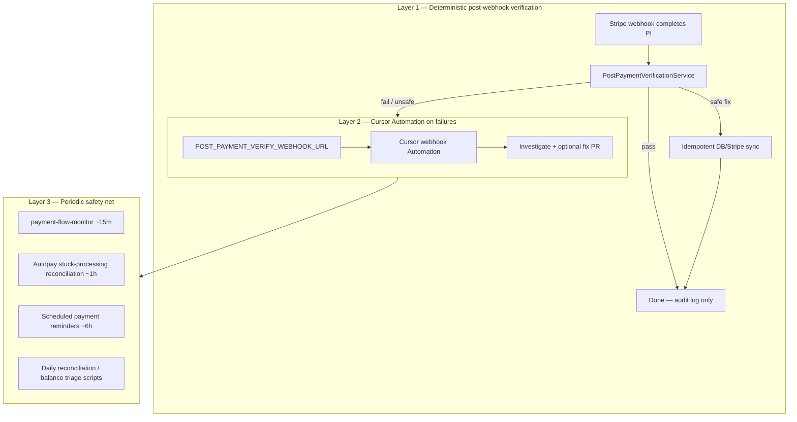

# Post-payment verification pipeline (architecture plan)

**Status:** Phase A implemented (read-only; enable with `POST_PAYMENT_VERIFY_ENABLED=true` on webhook worker). Phases B–D not implemented.  
**Last updated:** 2026-06-01  
**Related:** [`payment-flow-monitor.ts`](../../server/services/payment-flow-monitor.ts), [`payments-and-billing.md`](../APP_KNOWLEDGE/domains/payments-and-billing.md), [`AUTOPAY_PRODUCTION_CHECKLIST.md`](../AUTOPAY_PRODUCTION_CHECKLIST.md)

## Problem

After `payment_intent.succeeded`, the Stripe webhook and `PaymentProcessorService` can leave subtle drift: missed `payments` rows, under-allocated `total_paid`, scheduled installments on the wrong enrollment, autopay metadata without a saved card, or credits not consumed. Today, discovery is mostly manual (prod SQL, `inspect-parent-stripe-by-email.ts`, incident scripts).

## Goals

1. **Verify every successful checkout PI** (or a defined subset) within minutes of webhook completion.
2. **Auto-fix only safe, idempotent gaps**; route everything else to agents/humans.
3. **Layer with existing safety nets** — do not replace `payment-flow-monitor` or daily reconciliation.

## Three-layer architecture



| Layer | Trigger | Responsibility |
|-------|---------|----------------|
| **1** | `payment_intent.succeeded` (and manual payment completion hooks) | Run deterministic checks per PI; apply safe auto-fixes; emit structured verification result |
| **2** | Verification `failed` or `needs_review` | POST bounded payload to Cursor Automation; agent investigates root cause, may open PR — **no card charges** |
| **3** | Cron / singleton worker | Aggregate health (`payment-flow-monitor`), cancel stale installments when `effective_balance <= 0`, reconcile stuck `processing`, email reminders, optional daily batch |

Layer 1 must complete in-process (same request or fast async job on worker). Layer 2 is async and optional. Layer 3 already exists partially; extend with PI-level spot checks and daily “missed PI” sweeps.

## Checks per PaymentIntent (PI)

Run after webhook processing settles (or with short retry if `payments` row not yet visible).

| Check | What to compare | Severity |
|-------|-----------------|----------|
| **Stripe parity** | Stripe PI `status`, `amount`, `customer`, `metadata` vs `payments` + `stripe_payment_history` | Critical if succeeded in Stripe, missing in DB |
| **Enrollment ledger** | Allocated cents vs PI amount; `total_paid` / `effective_balance` / `payment_status` per `enrollment_ids` | Critical on mismatch; warning if `total_cost` ≠ plan total |
| **Scheduled payments** | Count, amounts, dates, `installment_number` 2…N on anchor enrollment; `metadata.enrollmentIds` | Critical if missing schedule for installment plan; warning if sum(scheduled)+first ≠ plan total |
| **Autopay readiness** | `users.stripe_customer_id`, `stripe_default_payment_method_id`, `metadata.autoPay` on pending rows | Warning if autoPay true but no saved PM |
| **Reminders** | `reminder_count`, due dates within policy window | Info / warning |
| **Credits** | Approved unused credits vs checkout snapshot / allocation | Critical if checkout expected credit application but `unified_credit_usage_logs` empty |

**Multi-enrollment biweekly:** Today remaining installments attach to `enrollment_ids[0]` only (`persistRemainingScheduledPaymentsAfterFirstCheckoutPayment` in `stripe-payment-plans.ts`). Verification must treat that as **intentional** but validate combined installment totals against sum of per-enrollment ledgers.

## Safe auto-fixes vs agent/human fixes

### Safe auto-fix (Layer 1 only)

Idempotent, bounded, no new Stripe charges:

- Create missing `payments` row from Stripe PI when PI succeeded and metadata checksum valid (reuse reconciliation patterns in `scheduled-payment-reminders.ts` / `reconcile-payment-intent-to-enrollments.ts`).
- Cancel stale `pending`/`overdue` scheduled_payments when enrollment `effective_balance <= 0` (same as `payment-flow-monitor` auto-heal).
- Backfill `stripe_payment_history` from PI when absent.
- Recompute `effective_balance`-derived fields when `remaining_balance` drift only (no change to cash totals).

### Agent / human (Layer 2+)

- Re-allocate `total_paid` across enrollments when combined checkout amount ≠ sum of allocations.
- Regenerate full scheduled_payment series (wrong phase count, wrong anchor dates).
- Apply or reverse credits; membership corrections.
- Refunds, partial captures, duplicate PI disputes.
- Any Stripe off-session charge or PaymentIntent creation.

## Environment variables

| Variable | Layer | Purpose |
|----------|-------|---------|
| `POST_PAYMENT_VERIFY_WEBHOOK_URL` | 2 | Cursor Automation endpoint when verification fails or needs review |
| `POST_PAYMENT_VERIFY_WEBHOOK_TOKEN` | 2 | Optional bearer for Layer 2 webhook |
| `PAYMENT_MONITOR_ALERT_WEBHOOK_URL` | 3 | Existing aggregate alert webhook (`payment-flow-monitor`) |
| `PAYMENT_MONITOR_ALERT_WEBHOOK_TOKEN` | 3 | Bearer for monitor webhook |
| `PAYMENT_MONITOR_INTERVAL_MS` | 3 | Monitor cadence (default 15m, min 60s) |
| `ENABLE_BACKGROUND_JOBS` | 3 | Singleton worker: reminders, reconciliation, monitor job |
| `AUTO_PAY_SINGLE_INSTANCE` | 3 | Guard so autoscaled replicas do not duplicate money jobs |
| `AUTOPAY_OFF_SESSION_CHARGES` | 3 | Off-session installment charges (worker only) |
| `AUTOPAY_RECONCILIATION_INTERVAL_MS` | 3 | Stuck `processing` reconciliation tick |
| `STRIPE_SECRET_KEY` | 1–3 | Stripe API for parity checks |
| `DATABASE_URL` | 1–3 | Prod/staging DB |

Layer 1 should run on the worker that processes webhooks **or** enqueue to the same singleton queue as other money-path jobs to avoid duplicate fixes.

## Phased implementation

### Phase A — Read-only verification + logging ✅

- `verifyPaymentIntent()` in `server/services/post-payment-verification.ts`.
- Async hook from `payment_intent.succeeded` in `server/webhook-handler.ts` via `schedulePostPaymentVerificationIfEnabled()` (default delay 2s).
- Persist to `payment_verification_logs`; critical results also write `error_logs` (`error_type: payment_verification`) unless `POST_PAYMENT_VERIFY_LOG_CRITICAL=false`.

**Enable on production (webhook / singleton worker):**

```bash
POST_PAYMENT_VERIFY_ENABLED=true
# optional:
POST_PAYMENT_VERIFY_DELAY_MS=2000
POST_PAYMENT_VERIFY_LOG_CRITICAL=true
```

Run `init-db` / deploy so `payment_verification_logs` exists.

### Phase B — Safe auto-fixes

- Wire idempotent fixes listed above behind `POST_PAYMENT_VERIFY_AUTO_FIX=true`.
- Metrics: fix applied / skipped / failed.

### Phase C — Cursor Automation on failure

- POST minimal payload to `POST_PAYMENT_VERIFY_WEBHOOK_URL` (PI id, check keys, tiers, enrollment ids — **no PII** or tokenize).
- Runbook for agent: prod read-only queries, compare Stripe, open PR for code fixes vs script for one-off ledger.

### Phase D — Hardening + daily sweep

- Extend `payment-flow-monitor` signals for “verification failed in last 24h”.
- Daily job: parents with succeeded Stripe PIs in last N days not in `payments` (email-indexed audit pattern).
- Parent/admin communication templates for corrections.

## Communication matrix

| Audience | When | Channel | Content |
|----------|------|---------|---------|
| **Parent** | Safe auto-fix, no balance change | None | — |
| **Parent** | Ledger correction changed balance | Email (`account-correction-summaries` pattern) | What changed, new balance, next due date |
| **Parent** | Autopay blocked (no PM) | Email + in-app | Save card; next installment date |
| **School admin** | Verification warning | In-app notification | Count + tier; link to admin payment tools |
| **School admin** | Critical / auto-fix failed | In-app + optional Layer 2 PR | PI reference, enrollment ids |
| **Platform admin** | Monitor critical / spike | `error_logs` + `PAYMENT_MONITOR_ALERT_WEBHOOK_URL` | Aggregate signals (existing monitor) |

## Open questions (product / ops)

1. **Cursor scope:** Invoke Automation on **every** payment (audit trail) vs **failures-only** (lower noise, faster ops)?
2. **Auto-fix policy:** Default `alert-only` in prod until Phase B burn-in? Which fixes require explicit opt-in per school?
3. **Parent email:** Send only when balance **changes** from correction, or also on “verification passed with warnings” (e.g. autopay not ready)?
4. **Multi-enrollment schedule:** Should Phase A flag combined installment total vs sum of `total_cost`, or only hard failures (missing rows)?
5. **Webhook placement:** Synchronous in webhook handler vs async job (latency vs consistency)?

## Key code references (today)

| Area | File |
|------|------|
| Webhook / PI processing | `server/api/stripe-webhook.ts`, `server/services/PaymentProcessorService.ts` |
| Scheduled payments after checkout | `server/services/stripe-payment-plans.ts` |
| Aggregate monitor | `server/services/payment-flow-monitor.ts`, `payment-flow-monitor-job.ts` |
| Stuck autopay reconciliation | `server/services/scheduled-payment-reminders.ts` |
| Prod audit scripts | `server/scripts/inspect-parent-stripe-by-email.ts`, `reconcile-payment-intent-to-enrollments.ts` |

## Success criteria

- Zero “succeeded in Stripe, missing in DB” older than 24h for new checkouts.
- Verification p95 &lt; 5s per PI on worker.
- No double-charge regressions (auto-fix whitelist reviewed in `asa-payment-patterns`).
- Documented runbook link from admin notification to this plan and `payments-and-billing.md`.
